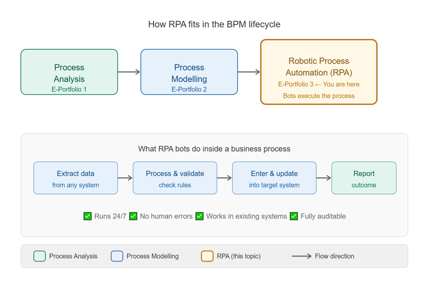
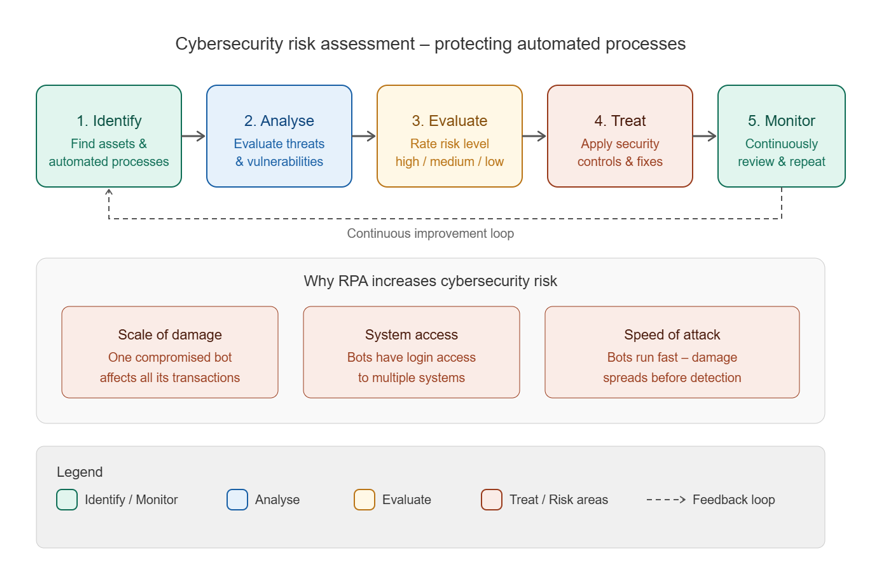

# COIT20252 – E-Portfolio 3: Robotic Process Automation and Process Cybersecurity

| | |
|---|---|
| **Student Name** | Joyee Chakraborty |
| **Student Number** | 12286715 |
| **Unit** | COIT20252 Business Process Management |
| **Topic** | Robotic Process Automation and Process Cybersecurity |

---

## Introduction

This e-portfolio presents four artefacts related to Robotic Process Automation (RPA) and Process Cybersecurity in Business Process Management (BPM). These artefacts were selected because they helped me understand how organisations use software bots to automate repetitive business processes, and why protecting those processes from cybersecurity threats is increasingly important. As an IT student I was already familiar with the concept of automation, but I had not previously connected it to BPM or considered the security risks that come with automating business processes. These artefacts helped me see RPA and cybersecurity as two sides of the same coin in modern BPM practice.

---

## Artefact 1 – YouTube: What is Robotic Process Automation (RPA)?

| Field | Details |
|---|---|
| **Type** |  YouTube Videos |
| **Published** | 2022 & 2026 |
| **Watch 1** | [What is Robotic Process Automation (RPA)? – IBM](https://www.youtube.com/watch?v=6S1etS5cLYI) |
| **Watch 2** | [Robotic Process Automation Explained: What is RPA](https://www.youtube.com/watch?v=8gSmiMESo2s) |
| **Relevance** | What RPA is, how bots work, why businesses use it |

**Artefact:** IBM 2022, *What is Robotic Process Automation (RPA)?*, YouTube, 17 August, viewed May 2026, <https://www.youtube.com/watch?v=6S1etS5cLYI>

**Artefact:** TechTarget 2026, *Robotic Process Automation Explained: What is RPA*, YouTube, 5 January, viewed May 2026, <https://www.youtube.com/watch?v=8gSmiMESo2s>

**Summary**

These two videos together gave me a complete picture of what Robotic Process Automation is and how it works in practice. The IBM video explains that RPA uses software bots to handle repetitive digital tasks — things like extracting data, filling forms, and moving files between systems — the same way a human worker would, but faster and without errors. The TechTarget video builds on this by explaining the three main types of RPA that IT teams use to automate different kinds of repetitive processes, showing how RPA has evolved from a simple task tool into a strategic business technology (IBM 2022, p. 1; TechTarget 2026, p. 1).

**Justification**

I chose both videos because together they gave me a much more complete understanding of RPA than either one alone. The IBM video was the perfect starting point — it explained RPA in plain language without technical jargon, which helped me as someone with no prior BPM experience. What surprised me most was learning that bots do not need new systems — they simply learn to use existing ones the way a human would. The TechTarget video then showed me how RPA has matured, with different types suited to different business needs. Watching both back to back helped me see RPA not just as a single tool but as a whole category of automation that is rapidly transforming how organisations operate.

### How RPA Works – Process Diagram         
.png)

---

## Artefact 2 – IBM: What is Robotic Process Automation (RPA)?

| Field | Details |
|---|---|
| **Type** | Industry Article |
| **Published** | 2025 |
| **Link** | [ibm.com/think/topics/rpa](https://www.ibm.com/think/topics/rpa) |
| **Relevance** | RPA definition, how bots work, connection to BPM |

**Artefact:** IBM 2025, *What is Robotic Process Automation (RPA)?*, IBM Think, viewed May 2025, <https://www.ibm.com/think/topics/rpa>

**Summary**

This IBM article explains what RPA actually is in straightforward terms. It describes how software bots take over repetitive digital tasks — things like copying data between systems, filling in forms, and processing invoices — that human workers would normally spend hours doing every day. The article also makes the point that RPA is not a standalone tool. It works best when it is applied to processes that have already been properly mapped and understood, which is what BPM is all about (IBM 2025, p. 1).

**Justification**

Before reading this I honestly thought RPA was just a fancy word for basic automation scripts that IT people write. This article changed that completely. What clicked for me was the part where IBM explained that RPA sits at the end of the BPM lifecycle — you analyse the process first, model it, and then automate it. That made me realise that everything I studied in E-Portfolios 1 and 2 was actually building towards this. Without process analysis and modelling, automating a broken process would just make the problems happen faster. That was a genuinely new way of thinking about it for me and it made the whole BPM lifecycle make a lot more sense.

### RPA in BPM Lifecycle

---

## Artefact 3 – IBM: What is a Cybersecurity Risk Assessment?

| Field | Details |
|---|---|
| **Type** | Industry Article |
| **Published** | 2025 |
| **Link** | [ibm.com/think/topics/cybersecurity-risk-assessment](https://www.ibm.com/think/topics/cybersecurity-risk-assessment) |
| **Relevance** | Cybersecurity risks in automated processes, risk assessment |

**Artefact:** IBM 2025, *What is a Cybersecurity Risk Assessment?*, IBM Think, viewed May 2025, <https://www.ibm.com/think/topics/cybersecurity-risk-assessment>

**Summary**

This IBM article explains that a cybersecurity risk assessment is a structured way of finding and fixing security weaknesses in an organisation's systems and processes. It walks through how organisations identify where they are most at risk, evaluate how serious each threat is, and then put controls in place to protect against them. The article makes a specific point that automated processes are especially vulnerable — because if a bot is compromised, it can cause damage across the whole organisation very quickly, not just in one isolated area (IBM 2025, p. 1).

**Justification**

Cybersecurity was the part of this topic I found hardest to connect to BPM at first. I kept thinking of it as a separate IT issue rather than something that belongs inside a business process discussion. This article changed that. The part that really stuck with me was the point about automated processes being a bigger target than manual ones — because a bot touching hundreds of transactions a day is a much more attractive target for an attacker than a single human doing the same job. That was a genuinely new way of thinking about RPA for me. It showed me that the more you automate, the more seriously you need to take security. As someone studying IT, that is something I will carry into my future work.

### Cybersecurity Risk Assessment Process

